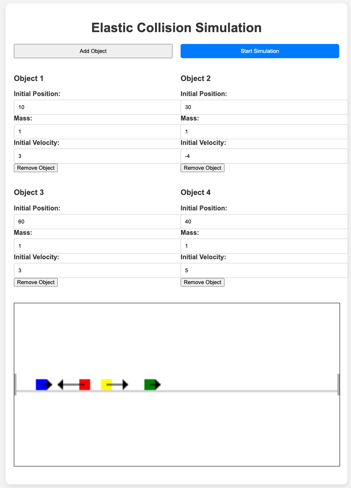

# Elastic Collision Simulator



## Project Overview
This Elastic Collision Simulator is an interactive web application that allows users to simulate the elastic collision of multiple objects in a 2D space. Users can add objects, set their initial positions, masses, and velocities, and then observe the dynamics of their collisions and interactions.

## Project Overview
This Elastic Collision Simulator is an interactive web application that allows users to simulate the elastic collision of multiple objects in a 2D space. Users can add objects, set their initial positions, masses, and velocities, and then observe the dynamics of their collisions and interactions.

## Features
- Dynamically add and remove objects with customizable properties (mass, velocity, and position).
- Drag objects to set their initial positions on the canvas.
- Visualize object movements and collisions in real-time.
- View velocity vectors for each object.

## Setup and Installation
**1. Clone the Repository**
```
git clone https://github.com/SvenSommer/elastic_collision_simulator.git

```

**2. Run backend**
```
cd elastic-collision-simulator
python3 app.py 
```

**3. Open the Webbrowser on http://127.0.0.1:5000/**

## Usage
- **Add Objects**: Click the 'Add Object' button to create a new object with default properties.
- **Edit Object Properties**: Use the input fields to set the mass, velocity, and initial position for each object.
- **Drag Objects**: Click and drag objects on the canvas to change their initial positions.
- **Start Simulation**: Click the 'Start Simulation' button to begin the simulation based on the current object properties.
- **Viewing the Simulation**: Observe the objects as they move and collide on the canvas. Velocity vectors are displayed as arrows.

